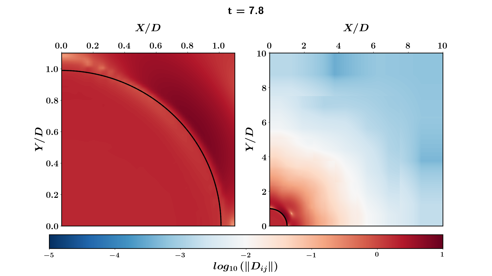

FacetsNFields.py is a python script which used *getData* (Basilisk Code) to get a scalar field (D2 in the present example)
along with the VOF facets (using *getFacet*: another Basilisk Code) and plots them together. 

Moreover, the code also shows the use of subplots (of the form 1 row, 2 columns) which use the same colorbar
An example: 

  

