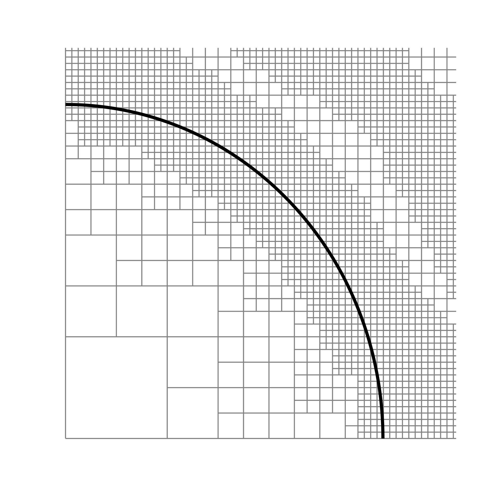

Cells.m is a matlab script which uses *getCells* (Basilisk Code) to get the location of grid cells (quadtree in this example)
along with the VOF facets (using *getFacet*: another Basilisk Code) and plots them together. 

An example: 

  

